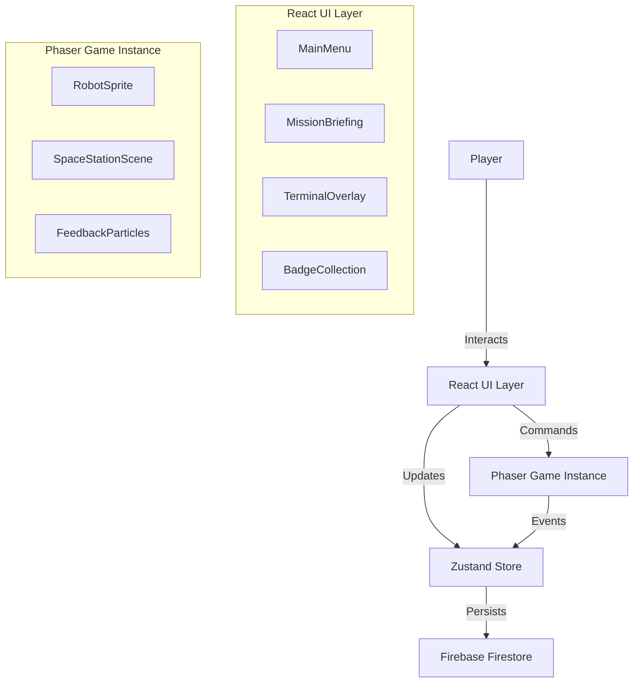

# TECHNICAL ARCHITECTURE
## ANTIGRAVITY: Robot Boss Academy

### 1. Overview
The application is a Single Page Application (SPA) built with React for the UI and Phaser 3 for the interactive game elements (animations, robot movements). It simulates the Antigravity environment within the browser.

### 2. Tech Stack
- **Frontend Framework:** React 18
- **Build Tool:** Vite
- **Game Engine:** Phaser 3 (integrated via `phaser-react-tools` or custom hook)
- **Styling:** Tailwind CSS (for UI overlays and menus)
- **State Management:** Zustand (lightweight, easy to use)
- **Code Editor:** `@monaco-editor/react` (VS Code web component)
- **Backend/Persistence:** Firebase (Auth + Firestore + Hosting)
- **Animations:** GSAP (for UI transitions), Phaser (for game objects)

### 3. Architecture Diagram


### 4. Key Components

#### 4.1. Game Manager (State)
- **UserProgress:** Tracks completed missions, XP, unlocked badges.
- **MissionState:** Current mission status (active, completed, failed), current step within mission.
- **TerminalState:** History of commands entered, current output.

#### 4.2. Terminal Simulator
- A React component attempting to replicate the feel of a terminal.
- Parses simple natural language commands or specific keywords related to the mission.
- **Parser Logic:** Regex-based matching for valid mission commands.

#### 4.3. Mission Engine
- **Mission Config:** JSON files defining objectives, valid commands, hints, and success criteria.
- **Validator:** Checks if the user's action matches the win condition.

### 5. Data Models

**UserProfile:**
```json
{
  "uid": "user123",
  "displayName": "Commander Alex",
  "xp": 450,
  "completedMissions": ["m1", "m2", "m3"],
  "badges": ["pilot", "organizer", "guardian"]
}
```

**MissionConfig:**
```json
{
  "id": "m1",
  "title": "Hello World",
  "level": 1,
  "steps": [
    {
      "instruction": "Click on the terminal",
      "trigger": "focus_terminal"
    },
    {
      "instruction": "Type 'login' and hit enter",
      "trigger": "command_login"
    }
  ]
}
```

### 6. Directory Structure
```
src/
├── assets/          # Images, audio, spritesheets
├── components/      # React components (UI)
│   ├── terminal/
│   ├── game/        # Phaser integration
│   └── shared/
├── config/          # Mission data, game constants
├── hooks/           # Custom hooks (useGameStore)
├── scenes/          # Phaser scenes (Boot, MainMenu, Workspace)
├── services/        # Firebase, Analytics
├── stores/          # Zustand stores
└── utils/           # Helpers
```
